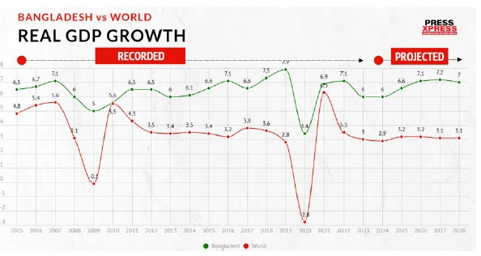
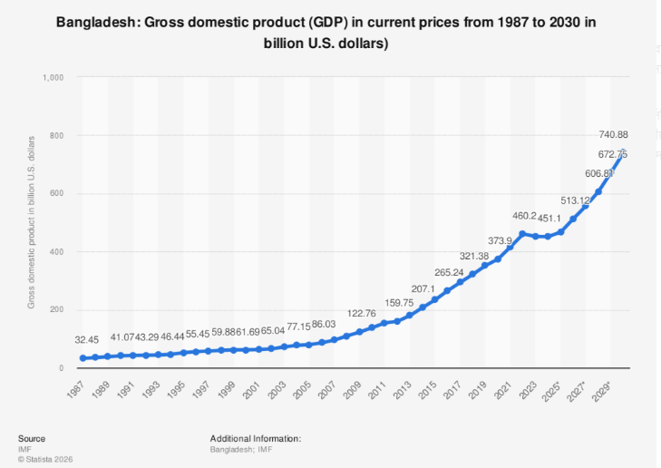
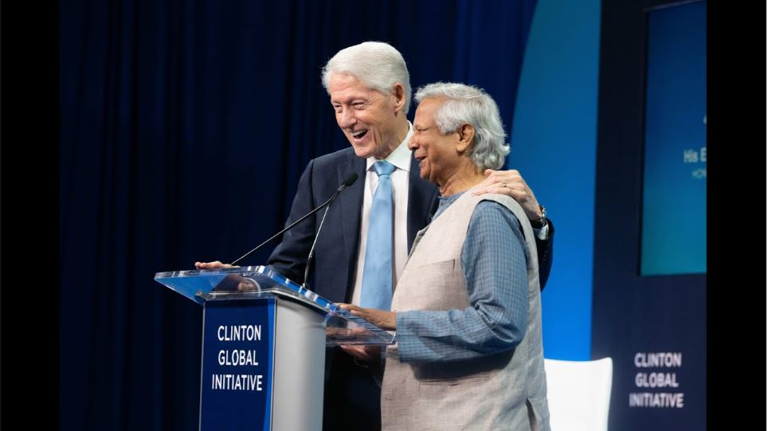
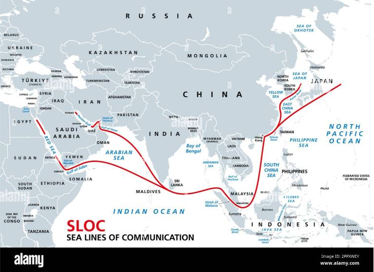
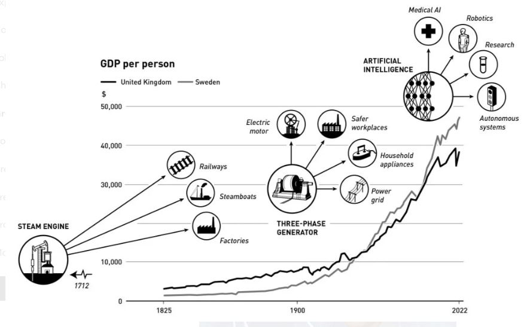

# Bangladesh: The Laboratory of Global Masterplan
## A Case Study on Invisible Imperialism

**Author:** Nurul Islam (@bd_nuru71)  
**Date:** February 08, 2026  
**Version:** 1.5 (Professional Edition with Full Documentation)  
**Generated by:** Research Wing, Geopolitical Strategy Unit  
**License:** CC-BY-SA 4.0

---

### 📋 Table of Contents
1. [Disclaimer](#-disclaimer)
2. [Abstract](#-abstract)
3. [Introduction: From Tip of the Iceberg to the Big Picture](#1-introduction-from-tip-of-the-iceberg-to-the-big-picture)
4. [The New Model of Regime Change](#2-the-new-model-of-regime-change)
5. [Information Warfare & Manufacturing Consent](#3-information-warfare--manufacturing-consent)
6. [The Indo-Pacific Strategy (IPS) & The Bay of Bengal](#4-the-indo-pacific-strategy-ips--the-bay-of-bengal)
7. [Creative Destruction: Building a Corporate State](#5-creative-destruction-building-a-corporate-state)
8. [Conclusion: The Feb 12 Referendum](#6-conclusion-the-feb-12-referendum)
9. [Key References & Citations](#-key-references--citations)

---

### 🛑 Disclaimer
This report analyzes geopolitical patterns, circumstantial evidence, and strategic shifts. It connects dots between global networks (Clinton-Soros-Epstein) and local political transitions to present a "Case Study" on modern regime change.

---

### 📌 Abstract
The political transition in Bangladesh (from the fall of Sheikh Hasina in 2024 to the Interim Government of Dr. Yunus) is not merely an internal crisis. Viewed through a geopolitical lens, Bangladesh has become a **"Laboratory"** for a new model of **"Invisible Imperialism."** This thesis explores how Civil Society, NGOs, and locked-in policies are used to transform a sovereign nation into a **"Client State"**.

---

### 1. Introduction: From Tip of the Iceberg to the Big Picture
Post-2024, Bangladesh is witnessing a strange paradox: global praise vs. local collapse.

* **Economic Reality:** GDP growth has stagnated (projected **4.6-4.9%** in 2026), inflation is near double digits (**8-10%**), and youth unemployment has crossed **30%**.
* **The Network:** The mention of Dr. Yunus in the Epstein Files (12-13 times in philanthropic contexts) indicates his deep integration into the global elite network. This branding serves as "Investment," and Regime Change is the "ROI."

**Figure 1.1: Bangladesh Real GDP Growth vs World Average**
*(A comparative analysis showing the stagnation period)*

**Figure 1.2: Long-term GDP Trajectory (1987-2030)**
*(Projected economic shifts under the new regime)*

*Source: [IMF World Economic Outlook](https://www.imf.org/en/Publications/WEO) & Statista Analysis.*

---

### 2. The New Model of Regime Change
Traditional military coups are obsolete. The new model uses "Engineered Chaos."

* **Mechanism:** Sanctions and economic pressure created a vacuum in 2024. Dr. Yunus was parachuted in as the "Savior."
* **Admission of Failure:** In a recent interview with *New Age*, Dr. Yunus admitted governance failures ("The government's eyes aren't that clear") but showed strategic indifference. In a Client State model, a leader's accountability is to global masters, not local citizens.

**Figure 2: Scenes from the 2024 Protests**
*(Visual representation of the engineered chaos leading to transition)*

*Source: [Al Jazeera Timeline](https://www.aljazeera.com) / Public Archives.*

---

### 3. Information Warfare & Manufacturing Consent
The Press Wing and Fact-Checkers are acting as "Guard Dogs" rather than "Watchdogs."

* **Strategy:** Legitimate criticism of the interim government is labeled as "disinformation."
* **Reality:** Despite **640+ journalists** being targeted and media attacks (Daily Star, Prothom Alo), the narrative remains controlled to manufacture consent.

**Figure 3: The Clinton-Yunus-Soros Connection**
*(Visualizing the global network supporting the regime)*

*Source: Public Domain / Clinton Global Initiative Archives.*

---

### 4. The Indo-Pacific Strategy (IPS) & The Bay of Bengal
* **The Feb 9 Trade Deal:** Signed just days before the election, this deal grants duty-free access for RMG but mandates the use of **US Cotton**. It captures Bangladesh's primary export sector.
* **Geopolitics:** This is part of the **China Containment** policy. Controlling the Bay of Bengal transforms Bangladesh into a strategic "Choke Point".

**Figure 4: Indo-Pacific Sea Lines of Communication (SLOC)**
*(Map highlighting the strategic importance of the Bay of Bengal)*

*Source: [Chatham House Research](https://www.chathamhouse.org) / Geopolitical Analysis.*

---

### 5. Creative Destruction: Building a Corporate State
Schumpeter’s theory of "Creative Destruction" is being applied to dismantle local institutions (Police, Judiciary, Administration).

* **Goal:** To replace sovereign structures with a colonial-style administration run by technocrats and NGOs.
* **Cost:** **1.5 million job losses** and **3 million new poor** are considered "collateral damage" in this transition.

**Figure 5.1: Illustration of Creative Destruction Concept**
*(Dismantling old structures for new control)*

**Figure 5.2: Historical GDP Shifts and Structural Change**
*(Economic context of structural resets)*

---

### 6. Conclusion: The Feb 12 Referendum
The Constitutional Referendum on the "July Charter" (Feb 12, 2026) is the final seal. It aims to lock these policies into the constitution, making Bangladesh a "Post-Sovereign State." If successful here, this model will be replicated in Myanmar and Africa.

---

### 📚 Key References & Citations
1.  **IMF & World Bank:** [World Economic Outlook Data](https://www.imf.org/en/Data) - Economic stagnation data (2025-2026).
2.  **New Age Interview:** Dr. Yunus's admission on governance failures.
3.  **Human Rights Watch (HRW):** [Bangladesh Country Reports](https://www.hrw.org/asia/bangladesh) - Reports on mass arrests and journalist targeting.
4.  **Chatham House:** [Indo-Pacific Strategies](https://www.chathamhouse.org) - Analysis on Bay of Bengal geopolitics.
5.  **Epstein Files (2025-26 Release):** Public domain documents referencing philanthropic connections.

---
### 📜 License
This work is licensed under a [Creative Commons Attribution-ShareAlike 4.0 International License](http://creativecommons.org/licenses/by-sa/4.0/).
